# ⚡ Astro Actions — Guía didáctica (con analogías a Next.js)

> **Disponible desde:** `astro@4.15` · **Persistencia de resultados con sesión:** `astro@5.0`

Como ya trabajaste con Next.js, la forma más rápida de entender las **Astro Actions** es pensarlas como el equivalente directo a las **Server Actions** de Next.js: funciones que viven en el servidor, pero que puedes **llamar directamente desde el cliente como si fueran funciones normales**, sin escribir un `fetch()` a mano ni montar un endpoint REST tú mismo.

---

## 1. ¿Qué problema resuelven?

Antes de las Actions, si querías mandar datos del cliente al servidor en Astro, tenías dos caminos:

1. Crear un **endpoint** (`src/pages/api/algo.ts`) y llamarlo con `fetch()` manualmente.
2. Procesar un `<form>` tradicional apuntando a ese endpoint.

Ambos casos te obligaban a escribir a mano: el `fetch`, el `JSON.stringify`/`JSON.parse`, la validación de los datos que llegan, el manejo de errores... mucho **boilerplate** repetido en cada endpoint.

Las **Actions** resuelven justo eso:

- ✅ Validan automáticamente los datos de entrada (JSON o de un formulario) usando **Zod**.
- ✅ Generan funciones **type-safe** que llamas directo desde el cliente — sin `fetch()` manual.
- ✅ Estandarizan los errores del backend con un objeto especial: `ActionError`.

```mermaid
flowchart LR
    subgraph ANTES["😫 Antes (endpoint manual)"]
        A1["Cliente: fetch('/api/x', {...})"] --> A2["Servidor: parsear JSON<br/>validar a mano<br/>manejar errores a mano"]
    end
    subgraph AHORA["😄 Ahora (Actions)"]
        B1["Cliente: actions.x({ datos })"] --> B2["Servidor: Zod valida automático<br/>handler() con tipos ya listos"]
    end

    style AHORA fill:#1e293b
    style B2 fill:#22c55e,color:#fff
```



---

## 2. Uso básico: tu primera Action

Toda Action se define dentro de un objeto `server`, exportado desde `src/actions/index.ts`.

```ts
// src/actions/index.ts
import { defineAction } from 'astro:actions';
import { z } from 'astro/zod';

export const server = {
  getGreeting: defineAction({
    // 👇 Zod valida el input ANTES de que tu handler lo reciba
    input: z.object({
      name: z.string(),
    }),
    // 👇 tu lógica de servidor. "input" ya llega validado y tipado
    handler: async (input) => {
      return `¡Hola, ${input.name}!`;
    },
  }),
};
```

Y así la llamas desde el cliente, importando `actions` desde `astro:actions`:

```astro
---
---
<button>Saludar</button>

<script>
  import { actions } from 'astro:actions';

  const boton = document.querySelector('button');
  boton?.addEventListener('click', async () => {
    const { data, error } = await actions.getGreeting({ name: 'Karen' });
    if (!error) alert(data);
  });
</script>
```

> 🔎 **Comparando con Next.js:** esto es prácticamente lo mismo que definir una función con `"use server"` y llamarla desde un componente cliente — la gran diferencia es que aquí Astro te obliga (para bien) a declarar un schema de Zod, y el resultado siempre viene envuelto en `{ data, error }` en vez de simplemente lanzar la promesa cruda.

---

## 3. Organizando varias Actions

No tienes que meter todo en un solo archivo. Puedes agrupar Actions relacionadas en objetos anidados, similar a como organizarías controladores en un backend tradicional:

```ts
// src/actions/user.ts
import { defineAction } from 'astro:actions';

export const user = {
  getUser: defineAction(/* ... */),
  createUser: defineAction(/* ... */),
};
```

```ts
// src/actions/index.ts
import { user } from './user';

export const server = {
  user, // 👈 se agrupan bajo un namespace
};
```

Ahora las llamas como `actions.user.getUser()` y `actions.user.createUser()` — mantiene todo ordenado a medida que el proyecto crece.

---

## 4. Manejando la respuesta: `data` y `error`

Toda Action devuelve **siempre** un objeto con `data` o `error`, nunca ambos a la vez. Por eso el patrón recomendado es checar el error primero:

```ts
const { data, error } = await actions.example();

if (error) {
  // manejar el caso de error
  return;
}

// aquí "data" ya está garantizado y tipado, sin necesidad de "if (data)"
```

### Atajo: `.orThrow()`

Si estás prototipando rápido, o usas una librería que ya captura errores por ti (como `react-query` o `SWR`), puedes usar `.orThrow()` para recibir `data` directamente y que cualquier error se lance como excepción normal:

```ts
const likesActualizados = await actions.likePost.orThrow({ postId: 'abc' });
//    ^ tipo: number
```

### `ActionError`: errores de servidor estandarizados

En vez de devolver `undefined` cuando algo sale mal, lanzas un `ActionError` con un código legible (`"UNAUTHORIZED"`, `"NOT_FOUND"`, etc.), similar a un status code HTTP:

```ts
import { defineAction, ActionError } from 'astro:actions';
import { z } from 'astro/zod';

export const server = {
  likePost: defineAction({
    input: z.object({ postId: z.string() }),
    handler: async (input, ctx) => {
      if (!ctx.cookies.has('user-session')) {
        throw new ActionError({
          code: 'UNAUTHORIZED',
          message: 'Debes iniciar sesión.',
        });
      }
      // lógica para dar "like"
    },
  }),
};
```

Y en el cliente, revisas `error.code` para decidir qué mostrar:

```tsx
const { error } = await actions.likePost({ postId });
if (error?.code === 'UNAUTHORIZED') {
  setShowLogin(true);
}
```

> 💡 Nota curiosa: Astro serializa la respuesta de las Actions con la librería **Devalue** (no JSON puro), así que puede transportar tipos que JSON no soporta de forma nativa, como `Date`, `Map`, `Set` y `URL`. Por eso no puedes inspeccionar la respuesta directamente en la pestaña "Network" como harías con un JSON normal — para depurar, revisa el objeto `data` en tu código.

---

## 5. Recibiendo datos de un `<form>`

Por defecto las Actions esperan JSON. Para que acepten un formulario HTML tradicional, agrega `accept: 'form'`:

```ts
export const server = {
  comment: defineAction({
    accept: 'form',
    input: z.object({
      email: z.email(),
      terminos: z.boolean(),
    }),
    handler: async ({ email, terminos }) => { /* ... */ },
  }),
};
```

Astro convierte automáticamente los campos del `<form>` (usando el atributo `name` de cada input) a un objeto, antes de pasarlo por tu validador de Zod. Reglas especiales que maneja por ti:

| Tipo de input | Validador de Zod recomendado |
| --- | --- |
| `type="number"` | `z.number()` |
| `type="checkbox"` | `z.coerce.boolean()` |
| `type="file"` | `z.instanceof(File)` |
| Varios inputs con el mismo `name` | `z.array(...)` |
| Cualquier otro | `z.string()` |

```astro
<form>
  <input type="email" name="email" required />
  <input type="checkbox" name="terminos" required />
  <button>Enviar</button>
</form>

<script>
  import { actions } from 'astro:actions';

  const form = document.querySelector('form');
  form?.addEventListener('submit', async (e) => {
    e.preventDefault();
    const formData = new FormData(form);
    const { error } = await actions.comment(formData); // 👈 le pasas el FormData directo
  });
</script>
```

---

## 6. 🌟 Lo que Next.js no tiene tan directo: Actions sin JavaScript (Zero-JS forms)

Aquí es donde Astro se pone interesante para alguien viniendo de Next.js: puedes llamar una Action **directamente desde el atributo `action` de un `<form>`, sin una sola línea de JavaScript en el cliente.** Esto sirve como *fallback* elegante si el JS falla en cargar, o simplemente si prefieres manejar todo desde el servidor.

> ⚠️ Requisito: la página debe estar en modo **on-demand** (`export const prerender = false`), ya que esto necesita un servidor corriendo para procesar el `POST`.

```astro
---
import { actions } from 'astro:actions';
---
<form method="POST" action={actions.logout}>
  <button>Cerrar sesión</button>
</form>
```

Astro convierte `action={actions.logout}` en una URL especial que el servidor sabe interpretar automáticamente.

### Leer el resultado en el servidor: `Astro.getActionResult()`

```astro
---
import { actions } from 'astro:actions';

const resultado = Astro.getActionResult(actions.newsletter);
---

{resultado?.error && (
  <p class="error">No se pudo completar el registro.</p>
)}

<form method="POST" action={actions.newsletter}>
  <input type="email" name="email" required />
  <button>Suscribirme</button>
</form>
```

`Astro.getActionResult()` devuelve `undefined` si el formulario aún no se ha enviado, o el `{ data, error }` correspondiente justo después del envío — todo esto **sin JavaScript en el cliente**.

### Redirigir tras un envío exitoso

```astro
---
import { actions } from 'astro:actions';

const resultado = Astro.getActionResult(actions.createProduct);

if (resultado && !resultado.error) {
  return Astro.redirect(`/productos/${resultado.data.id}`);
}
---
```

```mermaid
sequenceDiagram
    participant U as 🌍 Navegador
    participant S as 🖥️ Servidor Astro

    U->>S: POST /productos/crear (envío de &lt;form&gt;)
    S->>S: Ejecuta el handler() de la Action
    S->>S: Astro.getActionResult() lee el resultado
    alt Éxito
        S-->>U: Redirect a /productos/{id}
    else Error
        S-->>U: Vuelve a renderizar el form + mensaje de error
    end
```

---

## 7. Seguridad: las Actions son endpoints públicos

Esto es **crítico** y fácil de pasar por alto: cada Action queda expuesta como un endpoint público, con una URL predecible. Por ejemplo, `actions.blog.like()` se puede llamar directamente en `/_actions/blog.like`, sin pasar por tu UI. Esto es útil para debug, pero significa que **debes aplicar las mismas verificaciones de autorización que aplicarías a cualquier endpoint de API**, no puedes confiar en que "nadie va a adivinar la URL".

```ts
import { defineAction, ActionError } from 'astro:actions';

export const server = {
  getUserSettings: defineAction({
    handler: async (_input, context) => {
      // "context.locals" es donde normalmente guardas info de tu middleware de auth
      if (!context.locals.user) {
        throw new ActionError({ code: 'UNAUTHORIZED' });
      }
      return { /* datos si todo bien */ };
    },
  }),
};
```

También puedes filtrar Actions de forma centralizada desde el **middleware** (útil si quieres una sola verificación para todas):

```ts
// src/middleware.ts
import { defineMiddleware } from 'astro:middleware';
import { getActionContext } from 'astro:actions';

export const onRequest = defineMiddleware(async (context, next) => {
  const { action } = getActionContext(context);

  if (action?.calledFrom === 'rpc' && !context.cookies.has('user-session')) {
    return new Response('Forbidden', { status: 403 });
  }

  return next();
});
```

> 🔎 **Comparando con Next.js:** en Next.js las Server Actions tampoco son "invisibles" — también quedan expuestas como endpoints internos que se pueden invocar directamente. La lección es la misma en ambos frameworks: **nunca confíes solo en que la UI oculta la acción; siempre autoriza en el handler.**

---

## 8. Llamar Actions desde el servidor (no solo desde el cliente)

También puedes invocar una Action directamente desde el frontmatter de un componente `.astro` o desde un endpoint de servidor, usando `Astro.callAction()`. Esto es útil para reutilizar la misma lógica sin duplicar código:

```astro
---
import { actions } from 'astro:actions';

const busqueda = Astro.url.searchParams.get('search');

if (busqueda) {
  const { data, error } = await Astro.callAction(actions.findProduct, { query: busqueda });
  // usar el resultado igual que en el cliente
}
---
```

---

## 9. 🔎 Comparación mental con Next.js Server Actions

| Concepto | Next.js (Server Actions) | Astro (Actions) |
| --- | --- | --- |
| Cómo se declaran | `"use server"` en la función o archivo | `defineAction()` dentro de `src/actions/index.ts` |
| Validación de input | Tú la escribes a mano (o con Zod manualmente) | Integrada por defecto con Zod (`input: z.object(...)`) |
| Forma de la respuesta | Lo que retorna la función, tal cual (o lanza excepción) | Siempre `{ data, error }` (o `.orThrow()` para lanzar) |
| Errores estandarizados | No hay un formato oficial único | `ActionError` con `code` + `message` |
| Uso sin JavaScript (`<form action={fn}>`) | ✅ Soportado de forma nativa | ✅ Soportado (`action={actions.x}`, requiere SSR) |
| Leer resultado en el servidor tras un form | `useFormState` / `useActionState` (cliente) | `Astro.getActionResult()` (servidor) |
| Exposición como endpoint público | Sí, endpoint interno de Next | Sí, en `/_actions/nombre` |

---

## 📋 Tabla súper resumen (para consulta rápida)

| ¿Qué necesito? | Cómo se hace |
| --- | --- |
| Definir una Action | `defineAction({ input: z.object({...}), handler: async (input, ctx) => {...} })` en `src/actions/index.ts` |
| Agrupar Actions | Anidar objetos: `export const server = { user: { getUser, createUser } }` |
| Llamar desde el cliente | `import { actions } from 'astro:actions'` → `await actions.miAction({...})` |
| Leer el resultado | `const { data, error } = await actions.miAction(...)` |
| Ignorar manejo de error manual | `await actions.miAction.orThrow(...)` |
| Lanzar un error controlado | `throw new ActionError({ code: 'UNAUTHORIZED', message: '...' })` |
| Detectar tipo de error | Revisar `error.code` (ej. `'UNAUTHORIZED'`, `'NOT_FOUND'`) |
| Aceptar un `<form>` | `defineAction({ accept: 'form', ... })` |
| Validar checkbox / número / archivo | `z.coerce.boolean()` / `z.number()` / `z.instanceof(File)` |
| Llamar Action sin JS desde un form | `<form method="POST" action={actions.miAction}>` (requiere `prerender = false`) |
| Leer resultado de un form en el servidor | `Astro.getActionResult(actions.miAction)` |
| Redirigir tras éxito | `Astro.redirect(...)` usando el `data` del resultado |
| Detectar errores de campos de formulario | `isInputError(error)` → `error.fields.campo` |
| Preservar valores del input en error | `<input transition:persist ... />` + View Transitions activadas |
| Autorizar dentro del handler | Revisar `context.locals.user` (o cookies) y lanzar `ActionError({ code: 'UNAUTHORIZED' })` |
| Autorizar TODAS las Actions de golpe | Middleware + `getActionContext(context)` |
| Llamar una Action desde el servidor | `Astro.callAction(actions.miAction, input)` |
| URL pública de una Action | `/_actions/nombreDeLaAction` |

---

## 🧩 Conclusión

Las Astro Actions son, en esencia, un **RPC type-safe con validación integrada**: te ahorran escribir `fetch()`, `JSON.parse()` y validaciones manuales, y te dan un formato de error consistente (`ActionError`) en todo tu proyecto. Si vienes de Next.js, la curva de aprendizaje es mínima — el concepto es prácticamente el mismo, solo que Astro te obliga (para tu propio bien) a declarar el schema de validación desde el día uno, y te da un mecanismo elegante para que tus formularios sigan funcionando incluso sin JavaScript en el cliente.
