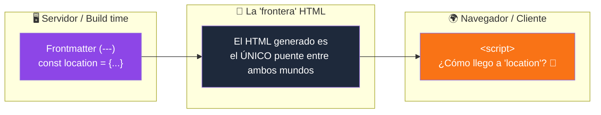
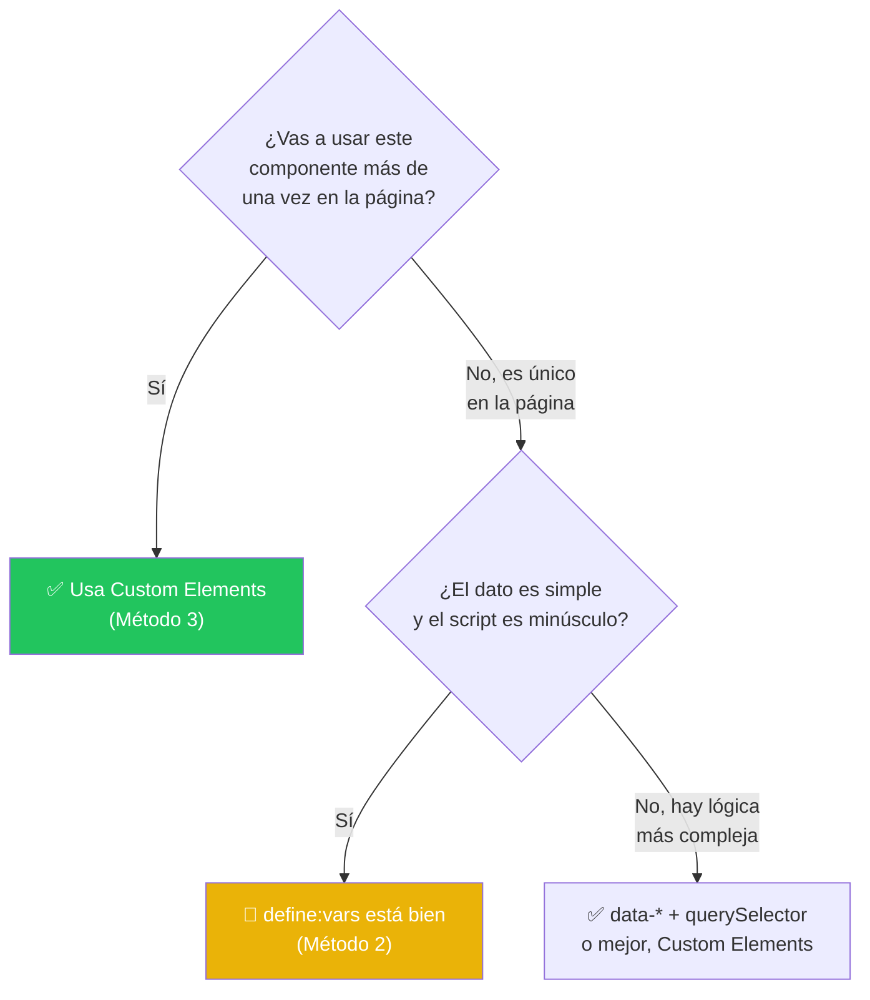

# 🔀 Pasar datos del servidor al cliente en Astro

## El problema de fondo

En Astro, el código del **frontmatter** (todo lo que está entre los `---`) se ejecuta **solo en el servidor** (o en el build, si la página es estática). Ese código **nunca llega al navegador**. Cuando escribes un `<script>` en tu componente, ese script sí corre en el navegador, pero vive en un mundo completamente aparte: no tiene acceso directo a las variables de tu frontmatter.



Como viste en el curso, existen (al menos) **tres formas** de cruzar esa frontera. Vamos a analizarlas a fondo: cómo funcionan, cuándo conviene cada una, y qué errores evitar.

---

## Método 1: `data-*` attributes + `querySelector`

```astro
---
import type { Location } from '@/types';
interface Props { location: Location }
const { location } = Astro.props as Props;
---

<div id="lat" data-lat={location.lat}>{location.lat}</div>

<script>
  const lat = document.querySelector('#lat');
  console.log(lat?.dataset.lat);
</script>
```

### ¿Cómo funciona?

El dato del servidor se "esconde" dentro de un atributo `data-*` del HTML ya renderizado. El `<script>` (uno normal, sin directivas) corre en el navegador, busca ese elemento con `querySelector`, y lee el valor desde la propiedad `dataset`.

### Ventajas

- El `<script>` **sí es procesado por Astro**: puedes usar TypeScript, `import` de otros archivos o paquetes de npm, y Astro lo empaqueta (bundlea) de forma óptima.
- Si el componente aparece varias veces en la página, Astro **deduplica el script**: solo se incluye una vez, sin importar cuántas veces uses el componente.
- Es el patrón más "estándar" y fácil de razonar si vienes del HTML/JS tradicional.

### ⚠️ El problema que no debes ignorar

En el ejemplo usas `id="lat"` y `document.querySelector('#lat')`. **Los `id` deben ser únicos en todo el documento HTML.** Si este componente se usa **más de una vez en la misma página** (algo súper común: piensa en una tarjeta de ubicación que se repite en una lista), vas a tener **varios elementos con el mismo `id`**, y `querySelector('#lat')` **siempre devolverá el primero**, ignorando los demás. Es un bug silencioso, difícil de detectar, y es la razón principal por la que Astro recomienda otro enfoque (que veremos en el método 3) quiere trabajar con múltiples instancias.

**Qué SÍ hacer si usas este método:** en vez de `id` + `querySelector`, usa una `class` + `querySelectorAll`, y recorre todos los elementos con un `forEach`. Así funciona sin importar cuántas veces se repita el componente.

---

## Método 2: `define:vars` + `is:inline`

```astro
---
import type { Location } from '@/types';
interface Props { location: Location }
const { location } = Astro.props as Props;
const lat = location.lat;
---

<div id="lat" data-lat={location.lat}>{location.lat}</div>

<script define:vars={{ lat }} is:inline>
  console.log(lat);
</script>
```

### ¿Cómo funciona?

`define:vars` es una directiva especial de Astro que toma tus variables del frontmatter, las serializa con `JSON.stringify()`, y las **inyecta literalmente como declaraciones `const` al inicio del script**, en el HTML final. Es la forma más directa y "mágica" de las tres.

### Lo que tienes que saber (y que el curso probablemente no profundizó)

1. **`define:vars` en un `<script>` implica automáticamente `is:inline`.** No es opcional: en el momento en que usas `define:vars` en un script, Astro deja de procesarlo. Esto significa:
   - ❌ No hay soporte de TypeScript (aunque el archivo lo tenga activado en el resto del proyecto).
   - ❌ No puedes usar `import` de paquetes npm ni de archivos locales dentro de ese script.
   - ❌ **No hay deduplicación.** Si el componente se repite 10 veces en la página, el script (con sus valores correspondientes) se repite 10 veces también, literalmente copiado y pegado en el HTML. Esto puede inflar el tamaño de tu página.

2. **Solo acepta datos serializables en JSON.** Funciona con strings, números, arrays y objetos planos, pero **no** con funciones, clases, `Map`, `Set`, `undefined`, etc.

3. **⚠️ Cuidado real de seguridad con datos no confiables.** Si el valor que pasas a `define:vars` proviene de datos controlados por el usuario (por ejemplo, un parámetro de la URL en una página con SSR) y **no lo saneas tú mismo**, existe riesgo de inyección de HTML/JavaScript (XSS). De hecho, se reportó una vulnerabilidad real en Astro (**CVE-2026-41067**, corregida en la versión **6.1.6**) donde un saneamiento incompleto en `define:vars` permitía a un atacante cerrar la etiqueta `<script>` de forma manipulada (usando variantes como `</Script>` o `</script >`) e inyectar HTML malicioso. **Lección práctica: mantén Astro actualizado, y nunca confíes ciegamente en pasar datos de fuentes externas (URL, formularios, APIs de terceros) directo a `define:vars` sin validarlos.**

### ¿Cuándo SÍ conviene?

Para valores **simples y puntuales** (un string, un número, un color) que necesitas disponibles de inmediato en un script pequeño, y donde no te importa que no se procese ni se deduplique. Es rápido de escribir, pero no escala bien.

---

## Método 3: Web Components (Custom Elements) ⭐ — el patrón recomendado por Astro

```astro
---
import type { Location } from '@/types';
interface Props { location: Location }
const { location } = Astro.props as Props;
---

<location-data
  data-lat={location.lat}
  data-lng={location.lng}
  data-zoom={location.zoom}
/>

<script>
  class LocationData extends HTMLElement {
    connectedCallback() {
      const lat = this.dataset.lat;
      const lng = this.dataset.lng;
      const zoom = this.dataset.zoom;
      // Aquí ya puedes usar lat, lng y zoom con normalidad
    }
  }
  customElements.define('location-data', LocationData);
</script>
```

### ¿Cómo funciona?

Se combina lo mejor de los dos métodos anteriores: los datos siguen viajando como atributos `data-*` (igual que el método 1), pero en lugar de buscarlos con `document.querySelector` desde afuera, se encapsula toda la lógica dentro de una **clase de Web Component**. El navegador ejecuta `connectedCallback()` **una vez por cada instancia** del elemento personalizado que encuentre en la página.

### ¿Por qué es el enfoque que recomienda la documentación oficial de Astro?

1. **Resuelve el problema del método 1 de raíz.** En vez de usar `document.querySelector()` (que busca en TODO el documento), usas `this.querySelector()` dentro de la clase, que solo busca **dentro de esa instancia específica**. No hay colisión de `id`, ni necesidad de `querySelectorAll` + `forEach` manual.
2. **Funciona automáticamente con múltiples instancias.** Aunque el `<script>` que define la clase solo se ejecuta (y se bundlea) **una vez** por página, el navegador llama a `connectedCallback()` por cada `<location-data>` que exista, así uses el componente 1 vez o 50 veces.
3. **El script SÍ es procesado por Astro**: TypeScript, imports, bundling y deduplicación — todas las ventajas del método 1, sin su desventaja.
4. Es el patrón que Astro recomienda especialmente cuando necesitas que tu script interactúe con **componentes de un framework de UI** (React, Vue, Svelte), ya que estos pueden no estar montados todavía cuando corre un script tradicional.

---

## 📊 Comparación directa

| Criterio | 1. `data-*` + querySelector | 2. `define:vars` + `is:inline` | 3. Custom Elements ⭐ |
| --- | --- | --- | --- |
| Procesado por Astro (TS, imports, bundling) | ✅ Sí | ❌ No | ✅ Sí |
| Se deduplica si el componente se repite | ✅ Sí | ❌ No, se copia N veces | ✅ Sí |
| Funciona bien con múltiples instancias | ⚠️ Solo si usas `class` + `querySelectorAll` | ⚠️ Sí, pero sin deduplicar | ✅ Sí, de forma nativa |
| Facilidad/rapidez para un caso simple | 🙂 Media | 😄 Muy alta | 🙂 Media-alta |
| Tipos de datos soportados | Strings (hay que convertir números/booleanos) | JSON-serializable | Strings (igual que el 1) |
| Riesgo de seguridad con datos de usuario | Bajo | ⚠️ Requiere cuidado (ver CVE arriba) | Bajo |
| Recomendado por la doc oficial de Astro | Aceptable | Solo para casos puntuales | ✅ Es el patrón mostrado como ejemplo oficial |

---

## 🎯 ¿Cuál deberías usar entonces?



**Regla general:** si tienes duda, **ve directo al método 3 (Custom Elements)**. Es prácticamente igual de simple de escribir que el método 1, pero te evita el bug de los `id` duplicados desde el principio, y escala sin cambios si mañana decides reutilizar el componente.

---

## 🚫 Qué NO debes hacer (resumen de errores comunes)

- **No uses `id` + `getElementById`/`querySelector('#id')` en componentes que planeas reutilizar.** Es la causa número uno de bugs de "solo funciona la primera instancia".
- **No metas datos sensibles o secretos** (API keys privadas, tokens de sesión completos, datos de otros usuarios) en `data-*` ni en `define:vars`. Todo lo que llega al HTML es visible para cualquiera que abra el "Ver código fuente" del navegador.
- **No pases datos de la URL, formularios o cualquier entrada de usuario directo a `define:vars` sin sanearlos**, especialmente en páginas con SSR (`export const prerender = false`). Como vimos, ha habido vulnerabilidades reales de XSS relacionadas justo con este patrón.
- **No abuses de `define:vars` para objetos grandes o complejos.** Al no bundlearse ni deduplicarse, puedes terminar duplicando kilobytes de JSON en cada instancia del componente.
- **No olvides que los valores de `data-*` siempre llegan como *strings*.** Si guardas un número o un booleano, tendrás que convertirlo tú mismo en el cliente (`Number(el.dataset.zoom)`, `el.dataset.activo === 'true'`).

---

## 🧩 Resumen

- El frontmatter de Astro vive en el servidor; el `<script>` vive en el navegador. El HTML generado es el único puente entre ambos.
- **`data-*` + querySelector**: sólido, pero cuidado con los `id` si el componente se repite.
- **`define:vars`**: el más rápido de escribir, pero sacrifica bundling, deduplicación y requiere cuidado extra con datos de usuario.
- **Custom Elements (Web Components)**: el patrón recomendado oficialmente por Astro — combina lo mejor de ambos mundos y es a prueba de instancias repetidas.
