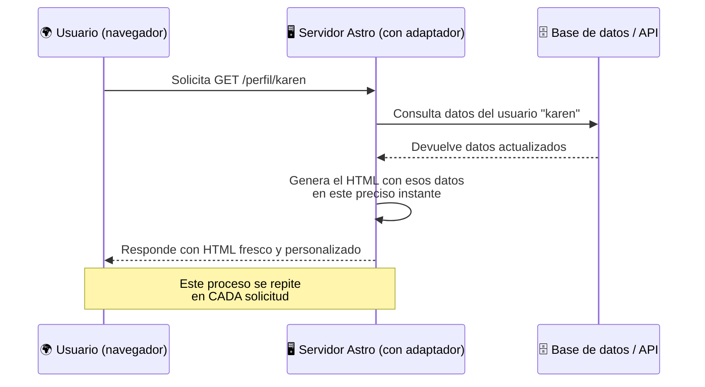
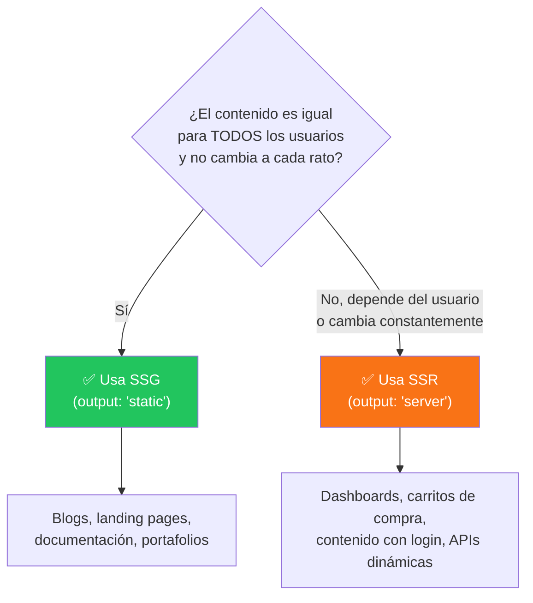
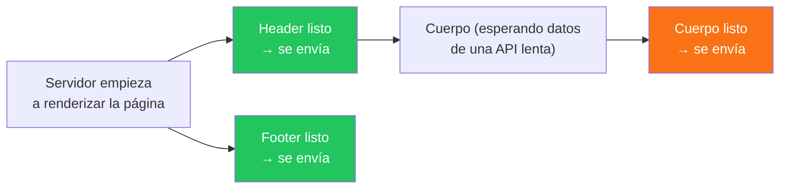

# 🧠 SSR vs SSG: Guía conceptual profunda + implementación en Astro

Antes de hablar de código, hay que entender una pregunta fundamental que todo framework web debe responder:

> **¿En qué momento se genera el HTML que ve el usuario?**

De esa pregunta nacen los dos grandes paradigmas de renderizado: **SSG** (Static Site Generation) y **SSR** (Server-Side Rendering). Astro es especial porque, a diferencia de la mayoría de frameworks, **no te obliga a elegir uno solo**: puedes mezclarlos página por página.

---

## 1. ¿Qué es SSG (Static Site Generation)?

**SSG** significa **Generación de Sitio Estático**. La idea es simple pero poderosa: el HTML de cada página se genera **una sola vez, durante el `build`** (cuando corres `npm run build`), y ese HTML queda guardado como archivos listos en disco. Cuando un usuario visita tu sitio, el servidor (o una CDN) simplemente le entrega el archivo `.html` que ya existía, sin hacer ningún cálculo extra.

Piénsalo como **hornear pan por adelantado**: horneas todas las piezas en la madrugada (build time), las pones en el aparador (tu CDN/hosting), y durante el día solo las entregas tal cual a quien las pida. Nadie espera a que el pan se hornee en el momento.

### Flujo de SSG


**Puntos clave:**

- El trabajo pesado ocurre **una sola vez**, en tu máquina o en un pipeline de CI/CD (no en cada visita).
- El resultado son archivos HTML "congelados" en el tiempo.
- Si el contenido cambia (por ejemplo, editas un artículo del blog), **necesitas volver a hacer build** para que el cambio se refleje.
- Es extremadamente rápido de servir porque no hay cómputo de por medio, solo transferencia de archivos.

---

## 2. ¿Qué es SSR (Server-Side Rendering)?

**SSR** significa **Renderizado en el Servidor**, pero en su forma moderna se le llama mejor **"on-demand rendering"** (renderizado bajo demanda): el HTML de una página **no existe todavía**. Se genera **en tiempo real, cada vez que alguien la pide**, en un servidor que sigue corriendo (no en un build que ya terminó).

Siguiendo la metáfora: SSR es como un **restaurante que cocina al momento**. El cliente hace su pedido (request), el chef (servidor) cocina ese plato específico con los ingredientes del momento (base de datos, sesión del usuario, cookies), y se lo entrega recién hecho.

### Flujo de SSR



**Puntos clave:**

- El HTML se construye **en cada petición**, siempre reflejando el estado más actual de los datos.
- Requiere un **servidor activo** (no puede vivir solo en una CDN estática); necesitas un **adaptador** (Node, Vercel, Netlify, Cloudflare, etc.).
- Es más lento que SSG por naturaleza (hay cómputo de por medio en cada visita), pero es indispensable cuando el contenido depende del usuario o cambia constantemente.

---

## 3. Comparación directa: SSG vs SSR



| Aspecto | SSG (Static) | SSR (Server / On-Demand) |
| --- | --- | --- |
| **¿Cuándo se genera el HTML?** | En el build (una sola vez) | En cada request (en tiempo real) |
| **Velocidad de respuesta** | Instantánea (archivo ya existe) | Depende del cómputo/DB en cada visita |
| **Necesita servidor corriendo** | No (se sirve desde una CDN) | Sí (Node, Deno, edge functions, etc.) |
| **Contenido personalizado por usuario** | ❌ Difícil/imposible sin JS del lado del cliente | ✅ Nativo y sencillo |
| **Costo de hosting** | Muy bajo (solo archivos estáticos) | Más alto (cómputo constante) |
| **SEO** | Excelente (HTML ya listo para crawlers) | Excelente también (HTML real, no CSR) |
| **Actualización de contenido** | Requiere nuevo build/deploy | Inmediata, sin rebuild |
| **Ejemplo típico** | Blog, portafolio, landing page | Dashboard con login, carrito, feed en vivo |

---

## 4. Casos de uso reales

### 📗 Cuándo usar SSG

- **Blogs y sitios de documentación**: el contenido se actualiza cuando tú publicas, no en cada visita (ej. este mismo tipo de curso, o Starlight, el framework de docs de Astro).
- **Landing pages / sitios de marketing**: el mismo contenido para todo el mundo, prioridad total en velocidad y SEO.
- **Portafolios personales**: pocos cambios, máxima velocidad.
- **Sitios de e-commerce con catálogo que cambia poco** (se puede regenerar con cada deploy o usar rutas híbridas para el carrito).

### 📙 Cuándo usar SSR

- **Dashboards y paneles con login**: cada usuario ve datos distintos (su perfil, su información privada).
- **Carritos de compra y checkout**: el estado cambia constantemente y depende de la sesión.
- **Contenido que depende de cookies o headers** (por ejemplo, mostrar precios según la región del usuario).
- **APIs y endpoints dinámicos**: por ejemplo, un endpoint que genera un número aleatorio, consulta una base de datos en vivo, o procesa un formulario.
- **Feeds en tiempo real** (notificaciones, chats, contenido que cambia segundo a segundo).

---

## 5. ¿Cómo se implementa esto en Astro?

Esta es la parte que hace especial a Astro: **el modo de renderizado se configura en `astro.config.mjs`, y puedes sobreescribirlo página por página**.

### 5.1 Modo por defecto: `output: 'static'` (SSG)

Por defecto, **todo tu proyecto Astro es estático** sin que tengas que configurar nada:

```js
// astro.config.mjs
import { defineConfig } from 'astro/config';

export default defineConfig({
  output: 'static', // esta es la opción por defecto, ni siquiera hace falta escribirla
});
```

En este modo, todas tus páginas se generan como HTML en `npm run build`.

### 5.2 Activar SSR: `output: 'server'`

Si tu proyecto necesita renderizado en el servidor en la mayoría de sus páginas, cambias el `output` **y agregas un adaptador** para la plataforma donde vas a desplegar (Node, Vercel, Netlify, Cloudflare...):

```bash
npx astro add node
# o npx astro add vercel / netlify / cloudflare
```

```js
// astro.config.mjs
import { defineConfig } from 'astro/config';
import node from '@astrojs/node';

export default defineConfig({
  output: 'server', // ahora TODO se renderiza bajo demanda por defecto
  adapter: node({ mode: 'standalone' }),
});
```

### 5.3 Lo mejor de ambos mundos: override por página con `prerender`

Aquí está la joya de Astro. **No tienes que elegir un solo modo para todo el sitio.** Puedes decirle a una página específica que se comporte diferente al resto usando la variable exportada `prerender`.

**Caso A — Proyecto mayormente estático, con una página dinámica:**

```astro
---
// src/pages/perfil.astro
export const prerender = false // 👈 esta página se sirve bajo demanda (SSR)

const cookie = Astro.cookies.get('sesion');
const usuario = await obtenerUsuario(cookie?.value);
---
<h1>Bienvenido, {usuario.nombre}</h1>
<p>Tu último acceso fue: {usuario.ultimoAcceso}</p>
```

El resto de las páginas de tu sitio (`index.astro`, `about.astro`, etc.) seguirán generándose de forma estática en el build, ¡sin ningún costo extra de servidor!

**Caso B — Proyecto mayormente dinámico, con una página estática:**

```astro
---
// src/pages/privacidad.astro
export const prerender = true // 👈 esta página SÍ se pre-renderiza en el build
---
<h1>Política de Privacidad</h1>
<p>Este contenido nunca cambia, así que no tiene sentido regenerarlo en cada visita.</p>
```

### 5.4 Ejemplo de un endpoint 100% dinámico (API route)

```astro
---
// src/pages/api/numero-random.json.ts
export const prerender = false

export async function GET() {
  const numero = Math.floor(Math.random() * 100);
  return new Response(JSON.stringify({ numero }), {
    headers: { 'Content-Type': 'application/json' },
  });
}
---
```

Cada vez que se visite `/api/numero-random.json`, se ejecutará este código y devolverá un número **diferente**, porque se calcula en el momento (esto sería imposible con SSG puro).

### 5.5 HTML Streaming (bonus conceptual)

Cuando usas `server` o tienes páginas con `prerender = false`, Astro aprovecha el **streaming de HTML**: en lugar de esperar a que toda la página termine de generarse para enviarla, Astro envía cada parte (componente) al navegador conforme la va terminando de renderizar. Esto hace que el usuario empiece a ver contenido más rápido, incluso si alguna parte de la página tarda en obtener datos.



---

## 6. Regla mental para no perderte

> **Empieza siempre en `static` (SSG).** Es el modo por defecto de Astro y el más performante. Solo cambia una página puntual a `prerender = false` cuando de verdad necesites datos frescos en cada visita o contenido personalizado por usuario. Solo cambia **todo el proyecto** a `output: 'server'` cuando la mayoría de tus páginas dependan de esto — así evitas pagar el "costo" de un servidor corriendo 24/7 cuando en realidad casi no lo necesitas.

---

## 🧩 Resumen ultra rápido

- **SSG** = el HTML se hornea una vez en el build → ultra rápido, ideal para contenido que no cambia por usuario.
- **SSR** = el HTML se cocina en cada visita → necesario para contenido personalizado, en vivo o dependiente de sesión.
- **Astro** te deja mezclar ambos con una sola línea (`export const prerender = true/false`) en cada página, sin tener que comprometerte a un solo enfoque para todo el proyecto.
